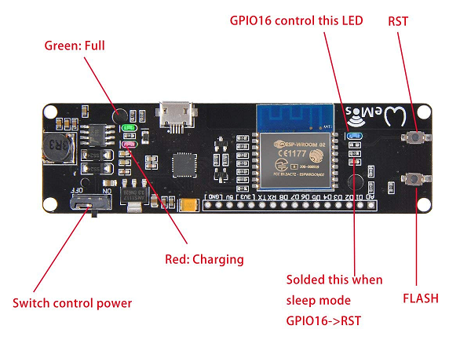

# ESP8266 LED Goggle Squad
Code for building a squad of LED goggles that automatically synchronize their animations when they're near each other

# Install pre-req's
1. Install the [CH340G driver (for D1 mini)](https://github.com/rorosaurus/esp8266-goggles/tree/master/drivers/CH340G)
2. Install [Arduino IDE](https://www.arduino.cc/en/Main/Software) (follow [these instructions to update the board manager URL in options](https://github.com/wemos/Arduino_D1))
3. In the Arduino IDE, I set Tools -> Board to `WeMos D1 R2 & mini`, and left the rest of the settings as default
4. Follow [these instructions](https://learn.adafruit.com/adafruit-all-about-arduino-libraries-install-use) to install the Arduino libraries from this repository, which are [stored here](https://github.com/rorosaurus/esp8266-goggles/tree/master/libraries)
5. Plug the board into your computer via micro USB
6. Turn the device on, and press the flash button (this seems to be optional), then you can upload your sketch!

# Parts List
* Microcontroller: [MakerFocus Wemos D1 Mini ESP8266 with integrated BMS](https://smile.amazon.com/gp/product/B075H8X7H2/)
  * The brains, wireless, battery holder and charger, all in one!
* Battery: [Panasonic NCR18650B](https://www.imrbatteries.com/panasonic-ncr18650b-18650-3350mah-protected-button-top-battery/)
  * Protected cell is important, because I don't trust the MakerFocus low voltage protection
  * These are taller than most 18650's, but they *barely* fit with a little force
* LED drivers: [Adafruit NeoPixel Ring - 16 x 5050](https://www.adafruit.com/product/1463)

# Links
* https://github.com/wemos/Arduino_D1
* https://wiki.wemos.cc/products:d1:d1_mini
* https://wiki.wemos.cc/_media/products:d1:sch_d1_mini_v3.0.0.pdf
* https://github.com/esp8266/Arduino
* https://arduino-esp8266.readthedocs.io/en/latest/
